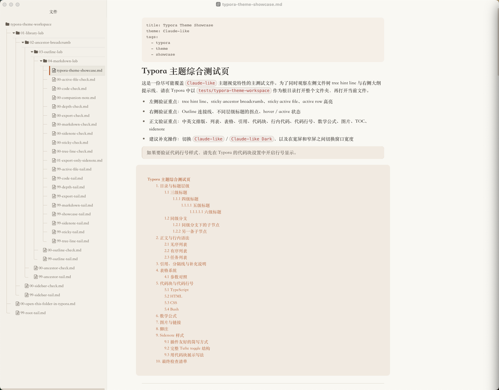
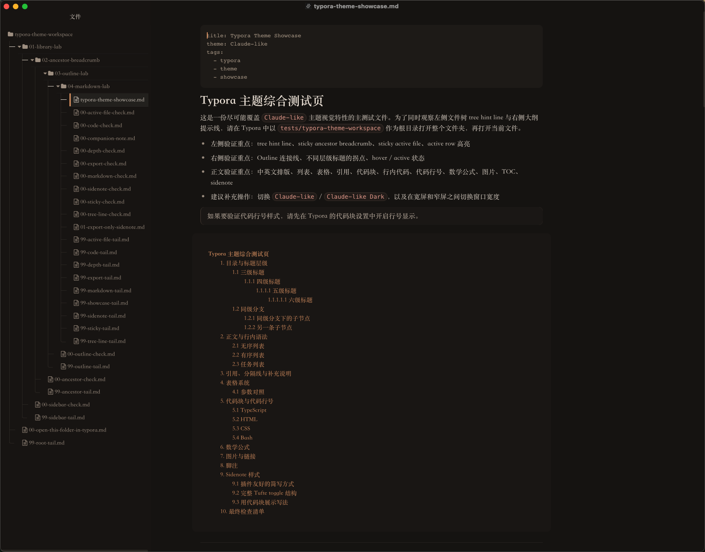
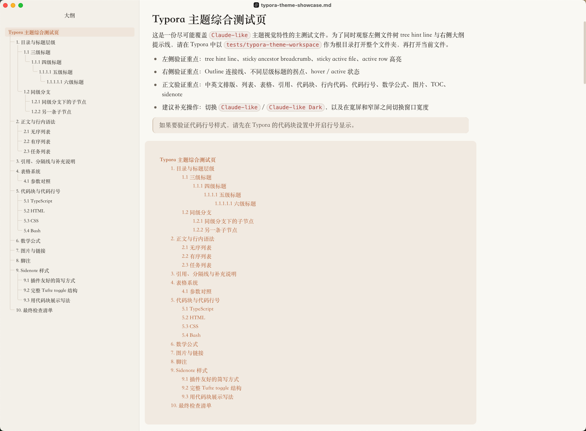
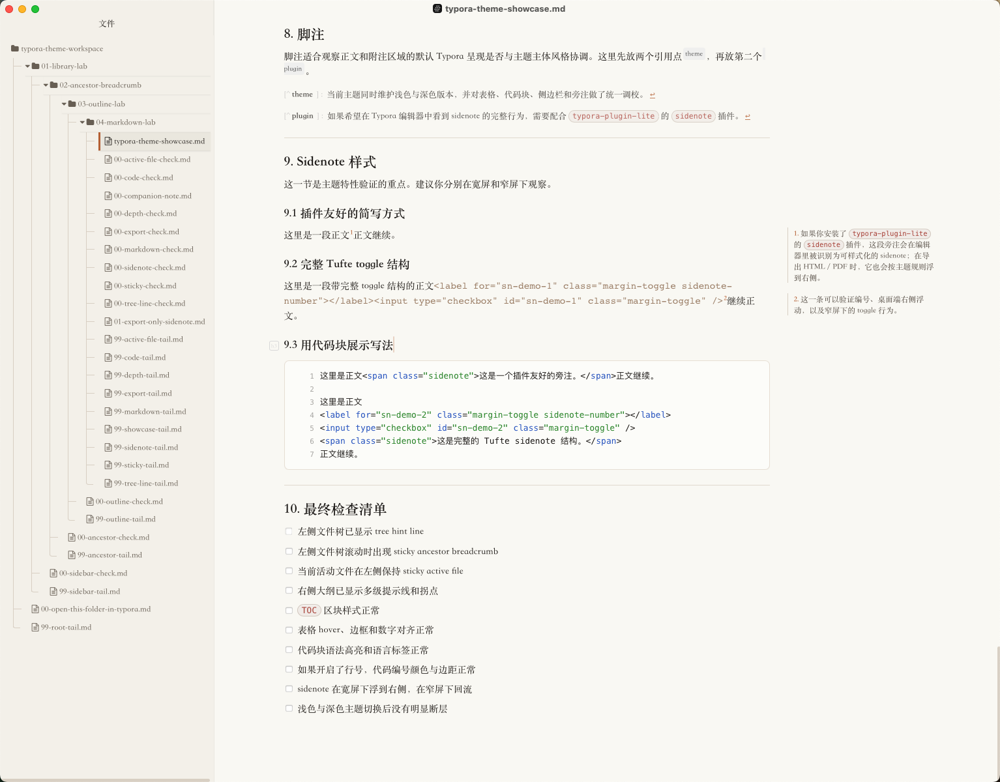
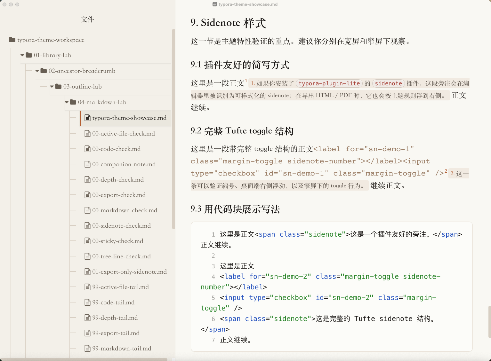

# Claude-Like Theme

[中文说明](README.md)







A Typora theme inspired by a Claude-like reading experience, refined for Chinese writing and technical Markdown workflows.

## Overview

This is not a one-to-one clone of a webpage. The goal is to bring a calmer, more restrained, long-form reading atmosphere into Typora, then adapt it for practical Markdown use with Chinese typography, tables, code blocks, sidebars, and export output in mind.

The repository currently includes:

- `claude-like.css`: light theme
- `claude-like-dark.css`: dark theme
- `tests/typora-theme-workspace`: a Typora demo workspace for sidebar, outline, Markdown, and sidenote verification

## Recent Feature Set

Based on the current CSS and recent `git log`, the theme now focuses on these areas:

- tree hint lines in the file library, including vertical stems, horizontal connectors, and rounded last-node endings
- sticky active file behavior plus sticky ancestor breadcrumb rows
- sticky depth support extended to 10 nested levels
- tree connector lines in the Outline sidebar with hover / active states
- wider writing area and image aspect-ratio protection
- refined checked-task styling
- Tufte-style sidenotes, plus editor-side styling when used with the `sidenote` plugin from `typora-plugin-lite`

## Installation

You can also download the latest files from GitHub Releases.

1. Open Typora.
2. Go to `Preferences -> Appearance -> Open Theme Folder`.
3. Copy these files into the theme folder:
   - `claude-like.css`
   - `claude-like-dark.css`
4. Restart Typora.
5. Select one of these themes:
   - `Claude-like`
   - `Claude-like Dark`

> On Windows, `Preferences -> Appearance -> Window Style -> Unibody` is recommended. The theme is tuned for that mode.

## Design Priorities

- Chinese-first typography for body text, headings, emphasis, and code
- calm long-form reading with soft contrast and generous spacing
- practical technical writing support for tables, code blocks, inline code, math, and export
- light and dark themes maintained as separate tuned variants, not simple inversions

## Visual Highlights

### 1. File Tree and Outline

- tree connector lines in the File Library
- clearer active-file highlighting with a left accent bar
- sticky ancestor folders when scrolling the file tree
- matching tree connector lines and corner handling in the Outline sidebar


### 2. Body Text and Markdown

- steadier Chinese and mixed Chinese-English text rhythm
- clearer heading hierarchy
- consistent styling for blockquotes, horizontal rules, lists, and task lists
- a dedicated `TOC` container style

### 3. Tables and Code

- unified table borders, spacing, numeric alignment, and row hover states
- capsule-like inline code styling
- fenced code blocks with borders, background, language labels, and syntax highlighting
- line-number styling also matches the theme if Typora line numbers are enabled

### 4. Sidenotes

The theme ships with Tufte-style sidenote rules for margin annotations.

Minimal usage:

```html
Body text<span class="sidenote">This is a sidenote.</span> body continues.
```

For the full in-editor numbered sidenote experience in Typora, use the `sidenote` plugin from [typora-plugin-lite](https://github.com/lr00rl/typora-plugin-lite). The plugin identifies the inline HTML marker and injects CSS-targetable classes; the theme handles the final appearance.

Wide-screen example:



Narrow-screen example:



## Demo Workspace

This repository now includes a dedicated Typora demo workspace:

- root folder: `tests/typora-theme-workspace`
- main showcase file: `tests/typora-theme-workspace/01-library-lab/02-ancestor-breadcrumb/01-outline-lab/02-markdown-lab/03-code-lab/04-sidenote-lab/05-export-lab/06-depth-lab/07-tree-line-lab/08-sticky-lab/09-active-file-lab/10-showcase/typora-theme-showcase.md`

Recommended test flow:

1. Open the whole `tests/typora-theme-workspace` folder in Typora.
2. Keep both File Library and Outline visible.
3. Open the deep `typora-theme-showcase.md` file.
4. Scroll the file tree to verify tree hint lines, sticky ancestor breadcrumb, and sticky active file behavior.
5. Use the main document to inspect heading hierarchy, TOC, tables, code blocks, code line numbers, math, images, footnotes, and sidenotes.
6. Switch between `Claude-like` and `Claude-like Dark`, then compare sidenote behavior at `>=1200px` and `<1200px` window widths.

## Best Use Cases

- long Markdown documents
- AI conversation cleanup and rewriting
- Chinese technical notes
- documentation with lots of tables and fenced code blocks
- documents that still need to export cleanly to PDF

## Files

- `claude-like.css`: light theme
- `claude-like-dark.css`: dark theme
- `README.md`: Chinese documentation
- `README_en.md`: English documentation
- `tests/typora-theme-workspace`: demo workspace

## Summary

If you want a Typora theme that feels calm, deliberate, and trustworthy rather than flashy, this one is built for that use case. The recent work has pushed the theme beyond article styling into the surrounding Typora UI as well, especially the file tree, outline connector lines, deep sticky behavior, and sidenote support.
